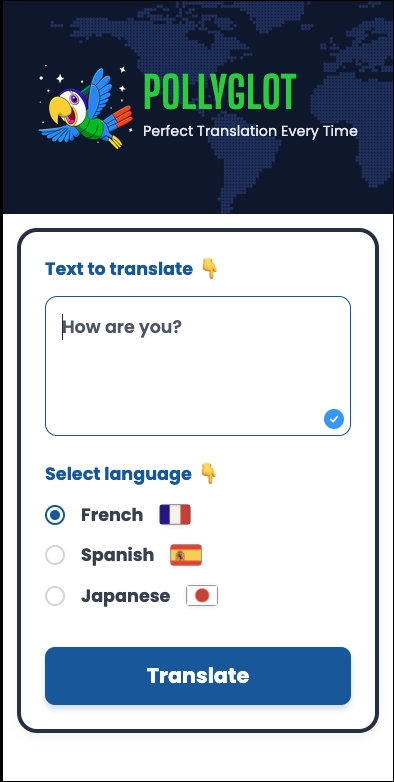
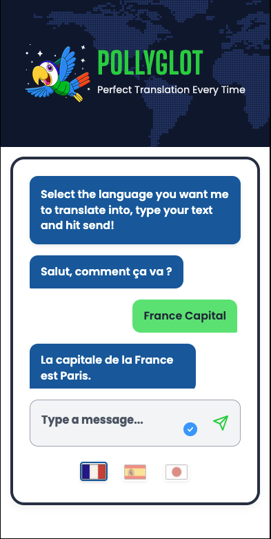

# 🦜 PollyGlot - AI Translation & Chat App

Welcome to **PollyGlot**! This isn't just your average translator; it's an AI-powered language companion that lets you translate text and then jump right into a conversation in that language! 🚀



## ✨ Features

- **Instant Translation**: Translate text into French 🇫🇷, Spanish 🇪🇸, or Japanese 🇯🇵 with a single click.
- **AI Chat Mode**: After translating, switch to "Chat Mode" to practice your skills with an AI conversation partner.
- **Smart Context**: The AI remembers your initial translation to kickstart the conversation naturally.
- **Premium UI**: A sleek, mobile-first dark mode design with neon accents.



## 🛠️ Tech Stack

- **Frontend**: HTML, CSS, Vanilla JavaScript
- **Build Tool**: Vite
- **AI Power**: OpenAI API (GPT-4o-mini)

## 🚀 Getting Started

1.  **Clone the repo** and hop into the directory.
2.  **Install dependencies**:
    ```bash
    npm install
    ```
3.  **Set up your API Key**:
    Create a `.env` file in the root and add your OpenAI key:
    ```env
    VITE_OPENAI_API_KEY=your_api_key_here
    ```
4.  **Run the app**:
    ```bash
    npm run dev
    ```

Happy Coding & Chatting! 💬